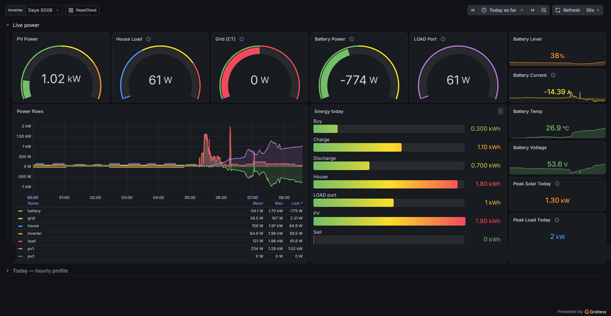
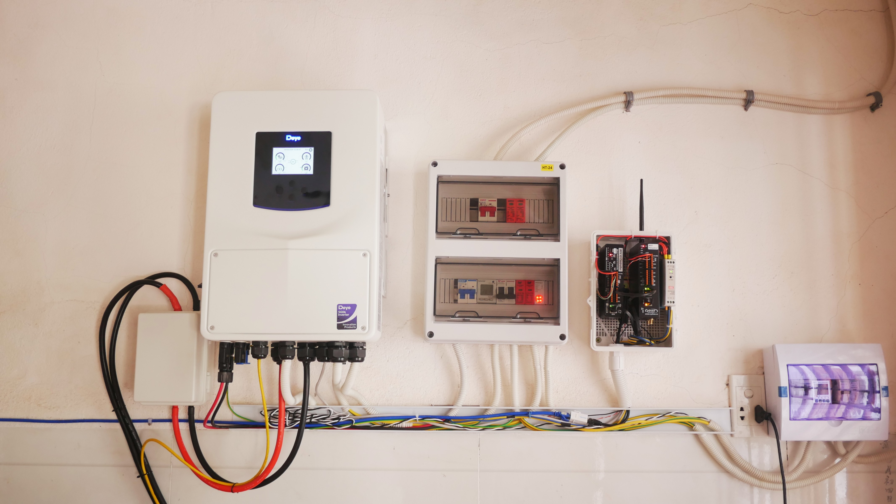
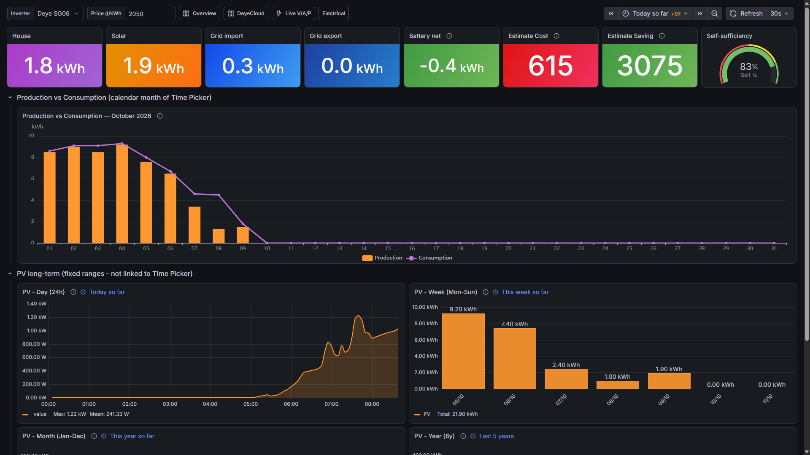
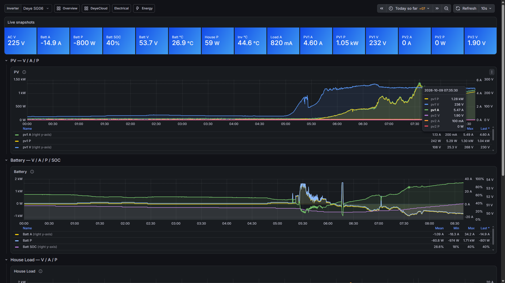
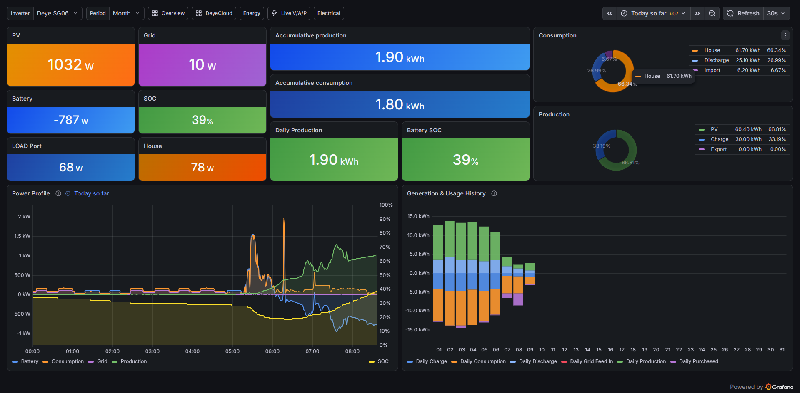

# Solar monitoring — MQTT → InfluxDB → Grafana

Solar energy monitoring stack: realtime MQTT ingest, InfluxDB time series, Grafana dashboards, plus optional **historical backfill** from cloud Excel exports (e.g. DeyeCloud).



**Tested with:** Deye **SUN-6K-SG06LP1** (hybrid, tag `sg06` / label “Deye SG06” in dashboards) on **IRIV Pi Control** (`192.168.3.249`).



**Also compatible with** other RS485 inverters (any brand) **once their data is published as MQTT** in the topic/payload contract below — this repo does not talk RS485 directly; it only consumes MQTT.

> Vietnamese overview: `[README-vn.md](README-vn.md)`

---


## Requirements

- **Docker** and **Docker Compose** installed on the host (e.g. the Pi) before you run this stack
- An MQTT broker publishing inverter metrics (Mosquitto on the LAN, or uncomment the optional service in `docker-compose.yml`)
- Optional: Python 3 + `openpyxl` (or Docker Python) for DeyeCloud Excel import

---


## Goals


| Goal                     | How                                                             |
| ------------------------ | --------------------------------------------------------------- |
| Live monitoring          | PV / battery / grid / house power, SOC, V/A/Hz                  |
| Energy reporting         | Daily / weekly / monthly / yearly kWh; estimated cost & savings |
| HA / ESP32 compatibility | MQTT topics `iriv/ivt/#` stay **unchanged**                     |
| Long-term history        | Forever bucket `solar_1d` + DeyeCloud Excel import              |
| Safe ops                 | Influx backup before migrate / import                           |


---


## Architecture

```
Deye SG06 (RS485)
    └─► IRIV IOC MQTT Gateway (e.g. 192.168.3.178)
            └─► Mosquitto @ 192.168.3.249:1883
                    topics: iriv/ivt/#     (inverter 1)
                            iriv/ivt-2/#   (inverter 2, optional)
                    │
                    ▼
              Telegraf  →  InfluxDB 2.7  →  Grafana :3000
                 │              │
                 │              ├─ solar_raw  (60 days, high resolution)
                 │              ├─ solar_1h   (~2 years)
                 │              └─ solar_1d   (forever — daily energy)
                 └─ Starlark: house/power + house/energy_today (derived)
```

- **Mosquitto** is optional in `[docker-compose.yml](docker-compose.yml)` (commented out by default) so an existing broker on `:1883` (HA / ESP32) is not conflicted. Uncomment only if you need Compose to start the broker.
- RS485 → IRIV IOC MQTT Gateway → Mosquitto: see `[iriv-ioc-mqtt-gateway](https://github.com/vantechcorner/deye-sg06-inverter-rs485-monitor/tree/main/iriv-ioc-mqtt-gateway)`.

---


## Data flow

1. Gateway polls the inverter → publishes JSON `{"value": …}` on MQTT.
2. Telegraf `mqtt_consumer` parses topics into tags `device` / `component` / `metric` and writes field `value` to measurement `solar`.
3. Starlark derives **House load (W)** and **House energy today (kWh)** (same formulas as the ESP32 dashboard).
4. Influx tasks downsample raw → `solar_1h` / `solar_1d`.
5. Grafana Flux: live series from `solar_raw`; completed-day energy prefers `solar_1d`.


### Influx schema


|                |                                       |
| -------------- | ------------------------------------- |
| Measurement    | `solar`                               |
| Tags           | `device`, `component`, `metric`       |
| Field          | `value`                               |
| Primary device | `sg06` (Grafana label: **Deye SG06**) |


Example: `iriv/ivt/battery/power` → `device=sg06, component=battery, metric=power`.

---


## Grafana dashboards (Solar folder)


| Dashboard            | Contents                                                           |
| -------------------- | ------------------------------------------------------------------ |
| **Solar Overview**   | Gauges / power / today’s energy                                    |
| **Solar Electrical** | V, A, Hz, temperature                                              |
| **Solar Live V/A/P** | Detailed live series                                               |
| **Solar Energy**     | kWh totals via time picker + PV day/week/month/year; cost / saving |
| **Solar DeyeCloud**  | DeyeCloud-style consumption / production / history                 |


Historical energy: `solar_1d` **+** `solar_raw` **(today)**. Do not raw-`sum()` `*_today` samples over a whole month (that double-counts).





---


## DeyeCloud backfill

If you install this Grafana + InfluxDB stack **after** the inverter has already been running (for weeks or months), MQTT only fills history from the day you turn Telegraf on. Past daily energy still lives in the manufacturer cloud (e.g. **DeyeCloud**). Export those reports and import them here so Solar Energy / DeyeCloud dashboards show a continuous timeline.

**How to do it**

1. In DeyeCloud (or equivalent), export **daily** energy reports as Excel for the months you need (often labeled as a monthly export — each row is still **one day**: Production, Buy/Sell, Charge/Discharge, Consumption).
2. Copy the `.xlsx` files into `deyecloud-data/` on the host (this folder is gitignored).
3. On the Pi (or wherever the stack runs), **backup Influx first**, dry-run the importer, then import for real:



```bash
./scripts/backup-influxdb.sh ./backups/pre-import-$(date +%F)
python3 scripts/import-deyecloud-energy.py --dry-run          # or Docker Python + openpyxl
python3 scripts/import-deyecloud-energy.py --i-have-backup
```

Only **daily kWh** is written to `solar_1d` (gaps are filled; existing MQTT days are left alone). Power/SOC curves cannot be reconstructed from Excel.

Column mapping and verification: [`note.md`](note.md) §11.

---


## Secrets / credentials

**Do not commit passwords or tokens.** Copy the example and fill real values:

```bash
cp .env.example .env
# edit .env — listed in .gitignore
docker compose up -d
```

Main variables: `INFLUX_USERNAME`, `INFLUX_PASSWORD`, `INFLUX_TOKEN`, `GRAFANA_ADMIN_USER`, `GRAFANA_ADMIN_PASSWORD`.

On the Pi, keep `.env` next to `docker-compose.yml` (`~/solar_monitoring/.env`).

---


## Quick deploy (Pi)

Prerequisites: Docker Engine + Compose plugin already installed.

```bash
cd ~/solar_monitoring
cp .env.example .env   # then edit secrets
chmod +x scripts/*.sh influxdb/scripts/setup-buckets.sh
docker compose up -d
./influxdb/scripts/setup-buckets.sh   # or ./scripts/migrate-cleanup.sh on first migrate
```

- Grafana: `http://192.168.3.249:3000`
- Influx: `http://192.168.3.249:8086`

Backup / restore / Flux cheat sheet / second inverter: see `[note.md](note.md)`.

---


## Repo layout

```
docker-compose.yml          # Influx + Telegraf + Grafana (+ Mosquitto commented)
.env.example                # secrets template
telegraf/                   # MQTT → Influx + house_derived.star
influxdb/scripts/           # buckets + downsample tasks
grafana/dashboards/         # provisioned JSON
grafana/provisioning/
scripts/                    # backup, DeyeCloud import, migrate, repair solar_1d
deyecloud-data/             # local Excel exports (gitignored)
note.md                     # detailed ops notes
README.md                   # this English overview
README-vn.md                # Vietnamese overview
```

